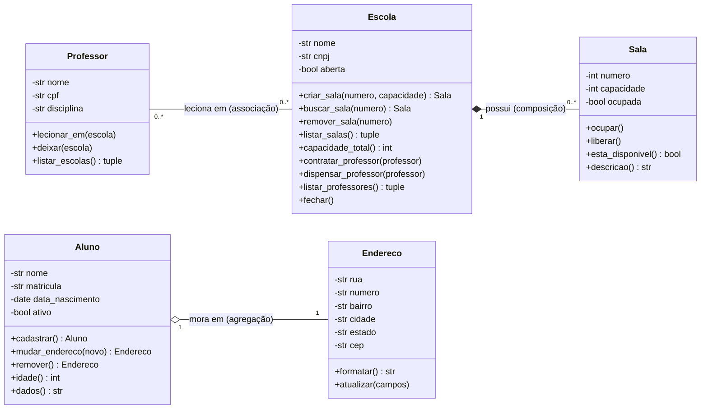

# Diagrama de classes UML

Notação: linha simples = associação, losango vazado = agregação,
losango preenchido = composição.

O diagrama aparece renderizado direto no GitHub. Para exportar como imagem,
cole o código em https://mermaid.live.